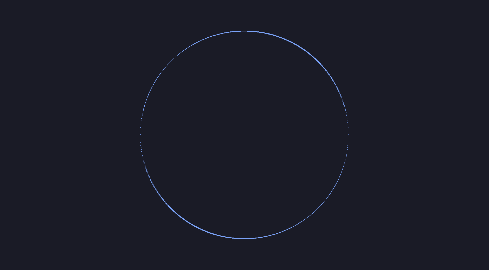

# MathViz - A math visualizer you didn't need

I was thinking about visualizing math functions, and decided to implement, how hard could it be?

# Examples

Here are some examples that I could make:

.png)
.png)

There are more in the [examples](examples) directory.
